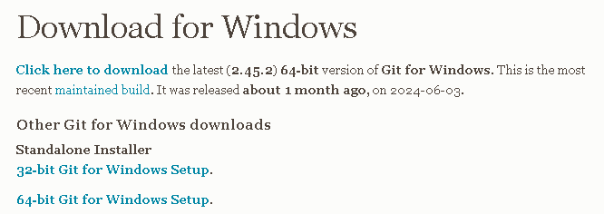
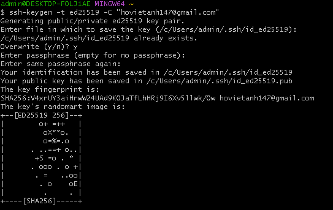
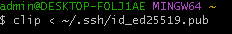
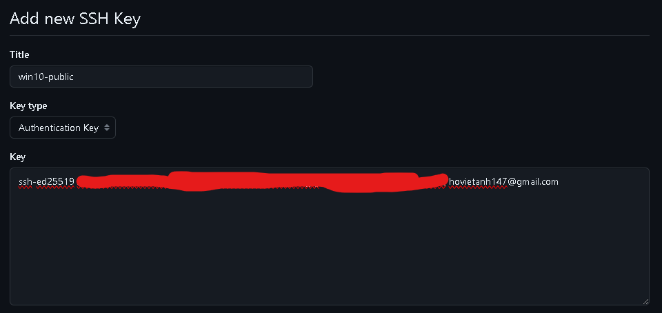

# Hướng dẫn cách cài đặt SSH Key cho GitHub
#### [AndyAnh174](https://github.com/AndyAnh174/)

# Tại sao cần SSH Key?? 🤔

Mã SSH key của GitHub được sử dụng để xác thực an toàn khi bạn kết nối và thao tác với kho lưu trữ GitHub thông qua giao thức SSH. Thay vì sử dụng phương thức xác thực bằng mật khẩu (password), bạn có thể sử dụng cặp khóa SSH để xác thực, bao gồm một khóa công khai và một khóa riêng tư.

Sau đây là cách cài đặt mã SSH key:

## Linux

`Bước 1`: Các bạn `Terminal` lên.

`Bước 2`: Các bạn nhập đoạn code như sau:
```sh
ssh-keygen -t ed25519 -C "your_email@example.com"
# Lưu ý: Nếu bạn đang sử dụng hệ thống cũ không hỗ trợ thuật toán Ed25519, hãy sử dụng: ssh-keygen -t rsa -b 4096 -C "your_email@example.com"
# Ví dụ: ssh-keygen -t ed25519 -C "hovietanh147@gmail.com"
```
Sau đó các bạn cứ nhấn Enter đến khi nào nó hiện như này là đúng 


`Bước 3`: Các bạn tiếp tục nhập cho mình đoạn code này:
```sh
cat ~/.ssh/id_ed25519.pub
# Sau đó chọn và sao chép nội dung
# hiển thị trong terminal vào clipboard của bạn
```


`Bước 4`: Các bạn vào trang github của các bạn (nhớ đăng nhập tài khoảng github trước khi vào), sau đó các bạn nhấn vào link này [tại đây](https://github.com/settings/keys).

`Bước 5`: Nó sẽ hiện ra giao diện như này.


Tiếp đó các bạn nhấn vào nút màu xanh `New SSH key`.


Nó sẽ hiển thị ra cái bảng add new key.


Và giờ chúng ta sẽ quay về `Bước 3`để copy key hiện trong terminal add vào thôi, Đây là Ví Dụ:


Nó hiện như này là xong rồi đoóo :333


## Windows
`Bước 1`: Các bạn cài `Git Bash` [tại đây](https://git-scm.com/download/win).
Các bạn chọn phiên bản cho phù hợp với máy tính của mình nha.



Các bạn có thể xem video hướng dẫn [tại đây](https://www.thegioididong.com/game-app/huong-dan-cach-tai-cai-dat-cau-hinh-git-tren-laptop-may-tinh-1299681).

`Bước 2`: Sau khi thực hiện việc cài đặt chúng ta mở `Git Bash` lên và thực hiện câu lệnh:
 ```sh
ssh-keygen -t ed25519 -C "your_email@example.com"
# Lưu ý: Nếu bạn đang sử dụng hệ thống cũ không hỗ trợ thuật toán Ed25519, hãy sử dụng:  ssh-keygen -t rsa -b 4096 -C "your_email@example.com"
# Ví dụ: ssh-keygen -t ed25519 -C "hovietanh147@gmail.com"
```
Sau đó các bạn cứ nhấn Enter đến khi nào nó hiện như này là đúng 



`Bước 3`: Các bạn tiếp tục nhập cho mình đoạn code này:
```sh
clip < ~/.ssh/id_ed25519.pub
# Sao chép nội dung của tệp id_ed25519.pub vào khay nhớ tạm của bạn
# Lệnh này dùng để copy câu lệnh (là nó tự động ctrl + C cho các bạn rồi)
```



Tiếp theo bạn có thể paste cái mã ssh key vừa copy được ra cái notepad, VD:


`Bước 4`: Các bạn vào trang github của các bạn (nhớ đăng nhập tài khoảng github trước khi vào), sau đó các bạn nhấn vào link này [tại đây](https://github.com/settings/keys).

`Bước 5`: Nó sẽ hiện ra giao diện như này.


Tiếp đó các bạn nhấn vào nút màu xanh `New SSH key`.


Nó sẽ hiển thị ra cái bảng add new key


Và giờ chúng ta sẽ lấy cái key mà đã paste vào notepad add vào thôi, Đây là Ví Dụ:



Nó hiện như này là xong rồi đoóo :333


## MacOS

Sẽ làm tương tự như windows và linux.